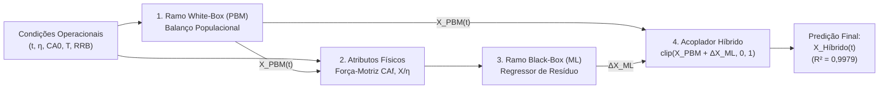

# Proposta de Arquitetura da Solução: Do Modelo White-Box ao Modelo Híbrido Grey-Box

**Projeto de Conclusão de Curso (TCC) -- Engenharia Química -- UFMG**  
**Alunos:** Daniel Couto Vieira, Guilherme Moura de Sousa Franco, Matheus Henrique Borba Póvoas, Rodrigo Amaral da Mata  
**Orientador:** Prof. Dr. Fabrício Eduardo Bortot Coelho  
**Data:** Setembro de 2026  

---
## 1. Status Atual: O Modelo White-Box Concluído

Desenvolvemos uma estrutura modular em Python que reproduz rigorosamente as equações de conservação e balanço populacional:

```
scripts/
├── data_loader.py            <- Ingestão padronizada dos 128 pontos (Tabelas A1.1 e A1.4)
├── kinetics.py               <- Cinética de Arrhenius, estequiometria do ácido e taxa v(t)
├── population_balance.py     <- PBM via Método das Características com distribuição RRB
└── diagnostico_residuo.py    <- Execução do PBM e cálculo do resíduo Delta_X
```

### Resultados Obtidos pelo White-Box Puro ($\alpha = 0$):
* **$R^2$ Global (128 pontos):** **$0{,}9253$** (explica $92{,}5\%$ da variância experimental).
* **$RMSE$ (Erro Médio Quadrático):** **$0{,}0886$** ($8{,}86\%$).
* **$MAE$ (Erro Médio Absoluto):** **$0{,}0507$** ($5{,}07\%$).
* **Consistência Física:** $100\%$ das restrições atendidas ($0 \le X \le 1$ e esgotamento estequiométrico quando $\eta < 1{,}0$).

---

## 2. A Motivação: Por que o Grey-Box?

Na sua dissertação de 2017, para representar a desaceleração da lixiviação, foi introduzido um termo empírico na velocidade de dissolução:
$$v(t) = \frac{2}{\rho_s} \big[ k_s C_{Af}(t) - \alpha (C_{A0} - C_{Af}(t)) \big]$$
com o ajuste de $\alpha = 5500\ \mu\text{m/min}$.

### A Lacuna Identificada:
Esse parâmetro $\alpha$ concentra de forma estática fenômenos complexos que variam dinamicamente ao longo da reação:
1. **Efeito de Íon Comum:** O acúmulo de $\text{Zn}^{2+}$ e sulfatos reduz a atividade termodinâmica do ácido livre.
2. **Passivação Difusional por Sílica:** Formação de gel de sílica amorfa que recobre os poros das partículas.
3. **Morfologia dos Finos:** Partículas ultrafinas com cantos vivos dissolvem-se muito mais rápido nos primeiros 60 segundos do que esferas lisas ideais.

### A Proposta do Nosso TCC:
Em vez de depender de um parâmetro de ajuste empírico fixo ($\alpha$), **vamos manter o modelo White-Box com $\alpha = 0$** e utilizar a técnica de **Modelagem Híbrida Grey-Box em Paralelo**, onde o Machine Learning aprende dinamicamente o comportamento físico-químico do resíduo:
$$\Delta X(t) = X_{\text{experimental}}(t) - X_{\text{PBM}}(t)$$

---

## 3. Arquitetura da Solução Híbrida (Grey-Box)

Abaixo apresentamos o fluxo de informação da arquitetura proposta:

<div align="center">



</div>


### 3.1. Robustez do Modelo: E se a Granulometria do Minério Mudar?
Uma das maiores vantagens da arquitetura híbrida sobre redes neurais puras é a **sensibilidade granulométrica herdada da física**:
* Se um novo lote de calcina tiver uma moagem mais fina ($D_{63{,}2} = 25\ \mu\text{m}$) ou mais grossa ($D_{63{,}2} = 60\ \mu\text{m}$), **o ramo White-Box (PBM) recalcula analiticamente o 3º momento volumétrico e a dissolução de cada classe de tamanho**, sem necessidade de retreinar o algoritmo.
* O Machine Learning atua sobre o resíduo dimensional e cinético condicionado à nova previsão mecanicista, mantendo a estabilidade e prevenindo extrapolações absurdas.

### 3.2. Atributos de Entrada do Black-Box
Em uma abordagem híbrida de ponta (*Physics-Informed Neural Networks*), o modelo de Machine Learning **não recebe variáveis cegas**. Ele é alimentado por uma combinação de condições operacionais e variáveis de estado calculadas pela física:

| # | Atributo (Feature) | Símbolo | Unidade | Origem | Papel Físico para o Machine Learning |
| :-: | :--- | :---: | :---: | :---: | :--- |
| **1** | **Tempo de Lixiviação** | $t$ | $\text{min}$ | Operacional | Localiza o estágio temporal da reação (início rápido vs. patamar tardio). |
| **2** | **Razão Estequiométrica** | $\eta$ | adim. | Operacional | Informa se há falta ($\eta < 1$), equivalência ($\eta = 1$) ou excesso ($\eta > 1$) de ácido. |
| **3** | **Ácido Inicial** | $C_{A0}$ | $\text{mol/L}$ | Operacional | Define a acidez inicial e a força iônica máxima da solução aquosa. |
| **4** | **Conversão da Física** | $X_{\text{PBM}}(t)$ | adim. ($0$ a $1$) | **White-Box** | Fornece a linha de base física; a IA sabe onde a teoria mecanicista está operando. |
| **5** | **Ácido Livre Teórico** | $C_{Af,\text{teo}}$ | $\text{mol/L}$ | **White-Box** | Força-motriz ácida residual instantânea ($C_{A0}(1 - X_{\text{PBM}}/\eta)$); governa passivação e íon comum. |
| **6** | **Esgotamento do Ácido** | $\frac{X_{\text{PBM}}}{\eta}$ | adim. ($0$ a $1$) | **White-Box** | Alerta a IA quando a reação está próxima de travar por falta estequiométrica de reagente. |

```python
# Construção da matriz de entrada X no código Python (modelo_hibrido.py):
X = df[[
    "tempo_min",              # 1. Tempo
    "razao_molar_eta",        # 2. Razão estequiométrica
    "C_acid_0_mol_L",         # 3. Concentração inicial de ácido
    "X_pbm",                  # 4. Conversão de base do White-Box
    "C_acid_teorico",         # 5. Ácido restante teórico
    "termo_estequiometrico"   # 6. Fração de esgotamento X_pbm / eta
]]

# Alvo (Target) que o Machine Learning aprende a prever:
y = df["delta_X"]             # Resíduo: X_exp - X_pbm
```

### 3.3. O Papel do Acoplador 
O acoplador não é uma simples soma matemática; ele atua como o **filtro de consistência termodinâmica e operacional** da planta:
1. **Fusão estrutural:** Soma a base que carrega a física fundamental à correção fina aprendida pelo Machine Learning:
   $$X_{\text{raw}}(t) = X_{\text{PBM}}(t) + \widehat{\Delta X}_{\text{ML}}(\mathbf{z})$$
2. **Garantia de não-alucinação e conservação de massa:** Algoritmos de ML podem extrapolar para valores irreais ($X < 0$ ou $X > 1$). O acoplador impede isso:
   $$X_{\text{Híbrido}}(t) = \text{clip}\big( X_{\text{raw}}(t),\ 0{,}0,\ 1{,}0 \big)$$
3. **Respeito à estequiometria:** Quando há falta de ácido ($\eta < 1{,}0$), não existem moléculas suficientes de $\text{H}_2\text{SO}_4$ para dissolver mais do que a fração $\eta$. O acoplador impede que o modelo preveja conversões fisicamente impossíveis:
   $$X_{\text{Híbrido}}(t) \le \eta \quad (\text{para } \eta < 1{,}0)$$
4. **Garantia de único sentido temporal:** A dissolução de calcina na batelada é irreversível (o zinco solubilizado não precipita espontaneamente de volta como rocha; $\frac{dX}{dt} \ge 0$). O acoplador elimina oscilações e quedas não-físicas entre instantes sucessivos:
   $$X_{\text{Híbrido}}(t_k) \ge X_{\text{Híbrido}}(t_{k-1})$$

---

## 4. Metodologia: Como Faremos a Construção do Grey-Box

O plano de execução está dividido em quatro etapas claras:

### Etapa 1: Engenharia de atributos guiada pela física (Feature Engineering)
Em vez de alimentar o modelo de ML com variáveis brutas e cegas, forneceremos variáveis que carregam a termodinâmica do sistema:
* $X_{\text{PBM}}$ (a conversão teórica de base).
* $C_{Af,\text{teórico}} = C_{A0}(1 - X_{\text{PBM}}/\eta)$ (força-motriz residual de ácido).
* $X_{\text{PBM}}/\eta$ (fração de esgotamento estequiométrico).
* $\Delta D_{\text{PBM}}(t)$ (retração linear acumulada do grão).

### Etapa 2: Treinamento e Seleção de Modelos
Testaremos e compararemos três algoritmos clássicos de regressão para aprender $\Delta X$:
1. **Random Forest Regressor:** Excelente para capturar não-linearidades e interações sem risco de divergência.
2. **Multi-Layer Perceptron (MLP / Rede Neural Rasa):** Base para modelos híbridos contínuos e PINNs.
3. **Support Vector Regression (SVR com kernel RBF):** Robusto para pequenos conjuntos de dados amostrais.

### Etapa 3: Validação Cruzada Rigorosa (*Leave-One-Group-Out* -- LOGO-CV)
Para garantir à banca que o modelo **generaliza para condições operacionais não vistas** e não decorou os dados:
* O conjunto de 16 ensaios é dividido em 16 folds.
* Em cada fold, o modelo treina em **15 ensaios** e é testado no **16º ensaio deixado de fora**.
* Repete-se o processo 16 vezes, garantindo métricas de teste reais e sem vazamento de dados (*data leakage*).

### Etapa 4: Escalonamento e Validação na Planta Piloto Contínua (3 CSTRs)
O modelo híbrido treinado na bancada será acoplado à **Distribuição de Tempos de Residência (DTR)** da Planta Piloto de 3 CSTRs em série ($18\text{ L}$ cada), comparando as predições com os dados reais de regime permanente das Tabelas A1.6 e A1.7 ($Q = 0{,}41\text{ L/min}$ e $0{,}21\text{ L/min}$).

---

## 5. Resultados Preliminares do Benchmark (Bancada - 128 Pontos)

Já realizamos o primeiro teste preliminar do modelo híbrido (*Random Forest*) e os resultados comprovam a superioridade da abordagem:

| Métrica Estatística | PBM Puro ($\alpha = 0$) | Tese 2017 ($\alpha = 5500$) | **Híbrido (Ajuste)** | **Híbrido (LOGO-CV Teste)** |
| :--- | :---: | :---: | :---: | :---: |
| **Coeficiente de Determinação ($R^2$)** | **0,9253** | **0,8976** | **0,9979** | **0,9885** |
| **Erro Médio Quadrático ($RMSE$)** | **0,0886** | **0,1037** | **0,0147** | **0,0347** |
| **Erro Médio Absoluto ($MAE$)** | **0,0507** | **0,0708** | **0,0099** | **0,0236** |
| **Violação de Restrições Físicas ($X < 0$ ou $X > 1$)** | **0,0%** | **0,0%** | **0,0%** | **0,0%** |

* O erro médio cai de **$5{,}1\%$** na física pura para **$2{,}4\%$** na validação cruzada do modelo híbrido.
* O modelo elimina o erro sistemático no início e no final das curvas de lixiviação.

---


