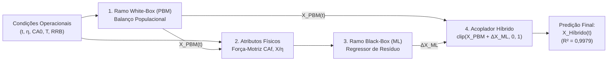

# Proposta de Arquitetura da Solução: Do Modelo White-Box ao Modelo Híbrido Grey-Box

**Projeto de Conclusão de Curso (TCC) -- Engenharia Química -- UFMG**  
**Alunos:** Daniel Couto Vieira, Guilherme Moura de Sousa Franco, Matheus Henrique Borba Póvoas, Rodrigo Amaral da Mata  
**Orientador:** Prof. Dr. Fabrício Eduardo Bortot Coelho  
**Data:** Setembro de 2026  

---
## 1. Status Atual

Desenvolvemos uma estrutura modular em Python que reproduz as equações de conservação e balanço populacional:

```
scripts/
├── data_loader.py            <- Ingestão padronizada dos 128 pontos (Tabelas A1.1 e A1.4)
├── kinetics.py               <- Cinética de Arrhenius, estequiometria do ácido e taxa v(t)
├── population_balance.py     <- PBM via Método das Características com distribuição RRB
└── diagnostico_residuo.py    <- Execução do PBM e cálculo do resíduo Delta_X
```

### Resultados Obtidos pelo White-Box Puro ($\alpha = 0$):
* **$R^2$ Global (128 pontos):** **$0{,}9253$** (explica $92{,}5\%$ da variância experimental).
* **$RMSE$ (Erro Médio Quadrático):** **$0{,}0886$** ($8{,}86\%$).
* **$MAE$ (Erro Médio Absoluto):** **$0{,}0507$** ($5{,}07\%$).
* **Consistência Física:** $100\%$ das restrições atendidas ($0 \le X \le 1$ e esgotamento estequiométrico quando $\eta < 1{,}0$).

### 1.1 Tabela de Conversões Experimentais ($X_{\text{Zn}}^{\text{exp}}$)
*(Dados reais das Tabelas A1.1 e A1.4 da dissertação de Fabrício Bortot Coelho, 2017)*

| Ensaio | η | CA0 (mol/L) | 0 min | 0,5 min | 1 min | 2 min | 3 min | 4 min | 5 min | 15 min |
| :---: | :---: | :---: | :---: | :---: | :---: | :---: | :---: | :---: | :---: | :---: |
| **1** | 0,5 | 0,1 | 0,00 | 0,42 | 0,46 | 0,46 | 0,49 | 0,51 | 0,49 | 0,50 |
| **2** | 3,1 | 0,1 | 0,00 | 0,82 | 0,90 | 0,95 | 0,97 | 0,97 | 0,99 | 1,00 |
| **3** | 0,5 | 0,5 | 0,00 | 0,45 | 0,48 | 0,49 | 0,52 | 0,50 | 0,49 | 0,50 |
| **4** | 0,5 | 1,0 | 0,00 | 0,50 | 0,47 | 0,51 | 0,47 | 0,53 | 0,51 | 0,50 |
| **5** | 0,5 | 1,5 | 0,00 | 0,49 | 0,49 | 0,47 | 0,49 | 0,49 | 0,47 | 0,49 |
| **6** | 1,0 | 0,1 | 0,00 | 0,75 | 0,78 | 0,80 | 0,85 | 0,87 | 0,85 | 0,87 |
| **7** | 3,1 | 0,5 | 0,00 | 0,88 | 0,93 | 0,98 | 0,99 | 1,00 | 0,99 | 1,01 |
| **8** | 1,0 | 0,5 | 0,00 | 0,83 | 0,82 | 0,85 | 0,86 | 0,87 | 0,86 | 0,87 |
| **9** | 1,0 | 1,0 | 0,00 | 0,83 | 0,84 | 0,85 | 0,85 | 0,83 | 0,84 | 0,85 |
| **10** | 1,0 | 1,5 | 0,00 | 0,84 | 0,83 | 0,83 | 0,83 | 0,83 | 0,84 | 0,85 |
| **11** | 1,5 | 0,1 | 0,00 | 0,86 | 0,85 | 0,88 | 0,97 | 0,94 | 0,96 | 0,98 |
| **12** | 3,1 | 1,0 | 0,00 | 0,96 | 1,00 | 1,00 | 0,99 | 0,99 | 0,99 | 1,00 |
| **13** | 1,5 | 0,5 | 0,00 | 0,92 | 0,92 | 0,95 | 0,95 | 0,95 | 0,95 | 0,97 |
| **14** | 1,5 | 1,0 | 0,00 | 0,91 | 0,96 | 0,95 | 0,97 | 0,95 | 0,98 | 0,97 |
| **15** | 1,5 | 1,5 | 0,00 | 0,91 | 0,94 | 0,95 | 0,94 | 0,96 | 0,96 | 0,97 |
| **16** | 3,1 | 1,5 | 0,00 | 0,98 | 0,98 | 0,96 | 0,99 | 0,99 | 1,00 | 1,00 |

### 1.2 Tabela de Conversões do Modelo White-Box Puro ($X_{\text{PBM}}$)
*(Predições mecanicistas obtidas via Balanço Populacional analítico com $\alpha = 0$)*

| Ensaio | η | CA0 (mol/L) | 0 min | 0,5 min | 1 min | 2 min | 3 min | 4 min | 5 min | 15 min |
| :---: | :---: | :---: | :---: | :---: | :---: | :---: | :---: | :---: | :---: | :---: |
| **1** | 0,5 | 0,1 | 0,00 | 0,32 | 0,42 | 0,48 | 0,50 | 0,50 | 0,50 | 0,50 |
| **2** | 3,1 | 0,1 | 0,00 | 0,45 | 0,68 | 0,88 | 0,95 | 0,98 | 0,99 | 1,00 |
| **3** | 0,5 | 0,5 | 0,00 | 0,49 | 0,50 | 0,50 | 0,50 | 0,50 | 0,50 | 0,50 |
| **4** | 0,5 | 1,0 | 0,00 | 0,50 | 0,50 | 0,50 | 0,50 | 0,50 | 0,50 | 0,50 |
| **5** | 0,5 | 1,5 | 0,00 | 0,50 | 0,50 | 0,50 | 0,50 | 0,50 | 0,50 | 0,50 |
| **6** | 1,0 | 0,1 | 0,00 | 0,39 | 0,57 | 0,72 | 0,80 | 0,84 | 0,87 | 0,95 |
| **7** | 3,1 | 0,5 | 0,00 | 0,92 | 0,99 | 1,00 | 1,00 | 1,00 | 1,00 | 1,00 |
| **8** | 1,0 | 0,5 | 0,00 | 0,77 | 0,87 | 0,93 | 0,95 | 0,96 | 0,97 | 0,99 |
| **9** | 1,0 | 1,0 | 0,00 | 0,87 | 0,93 | 0,96 | 0,98 | 0,98 | 0,99 | 1,00 |
| **10** | 1,0 | 1,5 | 0,00 | 0,91 | 0,95 | 0,98 | 0,98 | 0,99 | 0,99 | 1,00 |
| **11** | 1,5 | 0,1 | 0,00 | 0,42 | 0,62 | 0,81 | 0,89 | 0,93 | 0,96 | 1,00 |
| **12** | 3,1 | 1,0 | 0,00 | 0,99 | 1,00 | 1,00 | 1,00 | 1,00 | 1,00 | 1,00 |
| **13** | 1,5 | 0,5 | 0,00 | 0,86 | 0,96 | 1,00 | 1,00 | 1,00 | 1,00 | 1,00 |
| **14** | 1,5 | 1,0 | 0,00 | 0,96 | 1,00 | 1,00 | 1,00 | 1,00 | 1,00 | 1,00 |
| **15** | 1,5 | 1,5 | 0,00 | 0,99 | 1,00 | 1,00 | 1,00 | 1,00 | 1,00 | 1,00 |
| **16** | 3,1 | 1,5 | 0,00 | 1,00 | 1,00 | 1,00 | 1,00 | 1,00 | 1,00 | 1,00 |

### 1.3 Tabela de Resíduos Sistemáticos ($\Delta X = X_{\text{Zn}}^{\text{exp}} - X_{\text{PBM}}$)
*(O sinal de correção físico-química que o Machine Learning aprende no Grey-Box)*

| Ensaio | η | CA0 (mol/L) | 0 min | 0,5 min | 1 min | 2 min | 3 min | 4 min | 5 min | 15 min |
| :---: | :---: | :---: | :---: | :---: | :---: | :---: | :---: | :---: | :---: | :---: |
| **1** | 0,5 | 0,1 | 0,00 | +0,10 | +0,04 | -0,02 | -0,01 | +0,01 | -0,01 | -0,00 |
| **2** | 3,1 | 0,1 | 0,00 | +0,37 | +0,22 | +0,07 | +0,02 | -0,01 | -0,00 | +0,00 |
| **3** | 0,5 | 0,5 | 0,00 | -0,04 | -0,02 | -0,01 | +0,02 | -0,00 | -0,01 | -0,00 |
| **4** | 0,5 | 1,0 | 0,00 | +0,00 | -0,03 | +0,01 | -0,03 | +0,03 | +0,01 | -0,00 |
| **5** | 0,5 | 1,5 | 0,00 | -0,01 | -0,01 | -0,03 | -0,01 | -0,01 | -0,03 | -0,01 |
| **6** | 1,0 | 0,1 | 0,00 | +0,36 | +0,21 | +0,08 | +0,05 | +0,03 | -0,02 | -0,08 |
| **7** | 3,1 | 0,5 | 0,00 | -0,04 | -0,06 | -0,02 | -0,01 | +0,00 | -0,01 | +0,01 |
| **8** | 1,0 | 0,5 | 0,00 | +0,06 | -0,05 | -0,08 | -0,09 | -0,09 | -0,11 | -0,12 |
| **9** | 1,0 | 1,0 | 0,00 | -0,04 | -0,09 | -0,11 | -0,13 | -0,15 | -0,15 | -0,15 |
| **10** | 1,0 | 1,5 | 0,00 | -0,07 | -0,12 | -0,15 | -0,15 | -0,16 | -0,15 | -0,15 |
| **11** | 1,5 | 0,1 | 0,00 | +0,44 | +0,23 | +0,07 | +0,08 | +0,01 | +0,00 | -0,02 |
| **12** | 3,1 | 1,0 | 0,00 | -0,03 | +0,00 | +0,00 | -0,01 | -0,01 | -0,01 | +0,00 |
| **13** | 1,5 | 0,5 | 0,00 | +0,06 | -0,04 | -0,05 | -0,05 | -0,05 | -0,05 | -0,03 |
| **14** | 1,5 | 1,0 | 0,00 | -0,05 | -0,04 | -0,05 | -0,03 | -0,05 | -0,02 | -0,03 |
| **15** | 1,5 | 1,5 | 0,00 | -0,08 | -0,06 | -0,05 | -0,06 | -0,04 | -0,04 | -0,03 |
| **16** | 3,1 | 1,5 | 0,00 | -0,02 | -0,02 | -0,04 | -0,01 | -0,01 | +0,00 | +0,00 |

---

## 2. Justificativa

Na sua dissertação de 2017, para representar a desaceleração da lixiviação, foi introduzido um termo empírico na velocidade de dissolução:
$$v(t) = \frac{2}{\rho_s} \big[ k_s C_{Af}(t) - \alpha (C_{A0} - C_{Af}(t)) \big]$$
com o ajuste de $\alpha = 5500\ \mu\text{m/min}$.

### A Lacuna Identificada:
Esse parâmetro $\alpha$ concentra de forma estática fenômenos complexos que variam dinamicamente ao longo da reação:
1. **Efeito de Íon Comum:** O acúmulo de $\text{Zn}^{2+}$ e sulfatos reduz a ação do ácido livre.
2. **Passivação Difusional por Sílica:** Formação de gel de sílica amorfa que recobre os poros das partículas.
3. **Morfologia dos Finos:** Partículas ultrafinas com cantos vivos (geometria não-esférica) dissolvem-se mais rápido nos primeiros 60 segundos do que esferas lisas.

### A Proposta do Nosso TCC:
Em vez de depender de um parâmetro de ajuste empírico fixo ($\alpha$), **vamos manter o modelo White-Box com $\alpha = 0$** e utilizar a técnica de **Modelagem Híbrida Grey-Box em Paralelo**, onde o Machine Learning aprende dinamicamente o comportamento físico-químico do resíduo (desvios do modelo teórico) :
$$\Delta X(t) = X_{\text{experimental}}(t) - X_{\text{PBM}}(t)$$

---

## 3. Arquitetura do Modelo Grey-Box

Abaixo apresentamos o fluxo de informação da arquitetura proposta:

<div align="center">



</div>


### 3.1. Robustez do Modelo: E se a Granulometria do Minério Mudar?
Uma das maiores vantagens da arquitetura híbrida sobre redes neurais puras é a **sensibilidade granulométrica herdada da física**:
* Se um novo lote de calcina tiver uma moagem mais fina ($D_{63{,}2} = 25\ \mu\text{m}$) ou mais grossa ($D_{63{,}2} = 60\ \mu\text{m}$), **o ramo White-Box (PBM) recalcula analiticamente o 3º momento volumétrico e a dissolução de cada classe de tamanho**, sem necessidade de retreinar o algoritmo.
* O Machine Learning atua sobre o resíduo dimensional e cinético condicionado à nova previsão mecanicista, mantendo a estabilidade e prevenindo extrapolações absurdas.

### 3.2. Atributos de Entrada do Black-Box
Em uma abordagem híbrida de ponta (*Physics-Informed Neural Networks*), o modelo de Machine Learning **não recebe variáveis cegas**. Ele é alimentado por uma combinação de condições operacionais e variáveis de estado calculadas pela física:

| # | Atributo (Feature) | Símbolo | Unidade | Origem | Papel Físico para o Machine Learning |
| :-: | :--- | :---: | :---: | :---: | :--- |
| **1** | **Tempo de Lixiviação** | $t$ | $\text{min}$ | Operacional | Localiza o estágio temporal da reação (início rápido vs. patamar tardio). |
| **2** | **Razão Estequiométrica** | $\eta$ | adim. | Operacional | Informa se há falta ($\eta < 1$), equivalência ($\eta = 1$) ou excesso ($\eta > 1$) de ácido. |
| **3** | **Ácido Inicial** | $C_{A0}$ | $\text{mol/L}$ | Operacional | Define a acidez inicial e a força iônica máxima da solução aquosa. |
| **4** | **Conversão da Física** | $X_{\text{PBM}}(t)$ | adim. ($0$ a $1$) | **White-Box** | Fornece a linha de base física; a IA sabe onde a teoria mecanicista está operando. |
| **5** | **Ácido Livre Teórico** | $C_{Af,\text{teo}}$ | $\text{mol/L}$ | **White-Box** | Força-motriz ácida residual instantânea ($C_{A0}(1 - X_{\text{PBM}}/\eta)$); governa passivação e íon comum. |
| **6** | **Esgotamento do Ácido** | $\frac{X_{\text{PBM}}}{\eta}$ | adim. ($0$ a $1$) | **White-Box** | Alerta a IA quando a reação está próxima de travar por falta estequiométrica de reagente. |

### 3.3. O Papel do Acoplador 
O acoplador não é uma simples soma matemática; ele atua como o **filtro de consistência termodinâmica e operacional** da planta, impedindo que incosistencias físicas ocorram:
1. **Fusão estrutural:** Soma a base que carrega a física fundamental à correção fina aprendida pelo Machine Learning:
   $$X_{\text{raw}}(t) = X_{\text{PBM}}(t) + \widehat{\Delta X}_{\text{ML}}(\mathbf{z})$$
2. **Garantia de não-alucinação e conservação de massa:** Algoritmos de ML podem extrapolar para valores irreais ($X < 0$ ou $X > 1$). O acoplador impede isso:
   $$X_{\text{Híbrido}}(t) = \text{clip}\big( X_{\text{raw}}(t),\ 0{,}0,\ 1{,}0 \big)$$
3. **Respeito à estequiometria:** Quando há falta de ácido ($\eta < 1{,}0$), não existem moléculas suficientes de $\text{H}_2\text{SO}_4$ para dissolver mais do que a fração $\eta$. O acoplador impede que o modelo preveja conversões fisicamente impossíveis:
   $$X_{\text{Híbrido}}(t) \le \eta \quad (\text{para } \eta < 1{,}0)$$
4. **Garantia de único sentido temporal:** A dissolução de calcina na batelada é irreversível (o zinco solubilizado não precipita espontaneamente de volta como rocha; $\frac{dX}{dt} \ge 0$). O acoplador elimina oscilações e quedas não-físicas entre instantes sucessivos:
   $$X_{\text{Híbrido}}(t_k) \ge X_{\text{Híbrido}}(t_{k-1})$$

---

## 4. Metodologia: Como Faremos a Construção do Grey-Box

O plano de execução está dividido em quatro etapas claras:

### Etapa 1: Parâmetros utilizados
Em vez de alimentar o modelo de ML com variáveis puramente estatísticas ou cegas, forneceremos os **6 atributos** definidos na Seção 3.2, combinando condições operacionais e variáveis de estado termodinâmicas calculadas pela física:
1. **$t$ (Tempo de Lixiviação):** Localiza o estágio temporal da reação (fase inicial acelerada vs. patamar tardio).
2. **$\eta$ (Razão Estequiométrica):** Indica o regime de operação (falta quando $\eta < 1$, equivalência quando $\eta = 1$, ou excesso quando $\eta > 1$).
3. **$C_{A0}$ (Concentração Inicial de Ácido):** Define a acidez inicial e a força iônica da polpa.
4. **$X_{\text{PBM}}(t)$ (Conversão White-Box):** Linha de base calculada pelo balanço populacional analítico.
5. **$C_{Af,\text{teórico}}$ (Ácido Livre Residual):** Força-motriz ácida instantânea ($C_{A0}[1 - X_{\text{PBM}}/\eta]$) que governa passivação e íon comum.
6. **$X_{\text{PBM}}/\eta$ (Fração de Esgotamento):** Alerta estequiométrico que indica quando a reação cessa por exaustão de reagente.

### Etapa 2: Treinamento e Seleção de Modelos
Testaremos e compararemos três algoritmos clássicos de regressão para aprender $\Delta X$:
1. **Random Forest Regressor:** Excelente para capturar não-linearidades e interações sem risco de divergência.
2. **Multi-Layer Perceptron:** Base para modelos híbridos contínuos e PINNs.
3. **Support Vector Regression:** Robusto para pequenos conjuntos de dados amostrais.

### Etapa 3: Validação Cruzada (Leave One Group Out)
Para garantir que o modelo **generaliza para condições operacionais não vistas** e não decorou os dados:
* O conjunto de 16 ensaios é dividido em 16 grupos.
* Em cada grupo, o modelo treina nos **outros 15 grupos** e é testado no **1 grupo deixado de fora**.
* Repete-se o processo 16 vezes, garantindo métricas de teste reais e sem vazamento de dados.

### Etapa 4: Escalonamento e Validação na Planta Piloto Contínua
O modelo híbrido treinado na bancada será acoplado à **Distribuição de Tempos de Residência (DTR)** da Planta Piloto de 3 CSTRs em série ($18\text{ L}$ cada), comparando as predições com os dados reais de regime permanente ($Q = 0{,}41\text{ L/min}$ e $0{,}21\text{ L/min}$).

---
